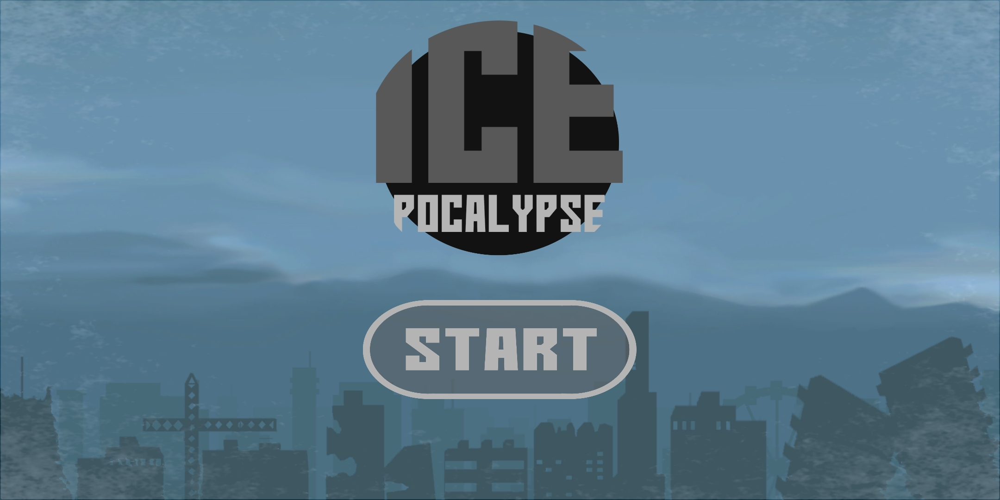
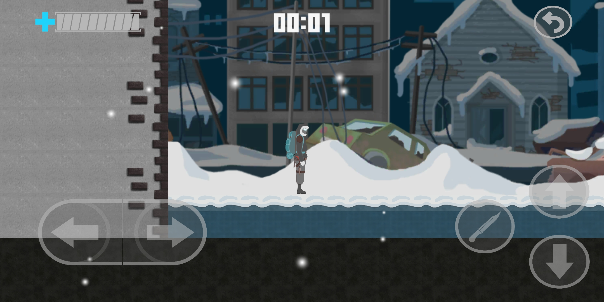
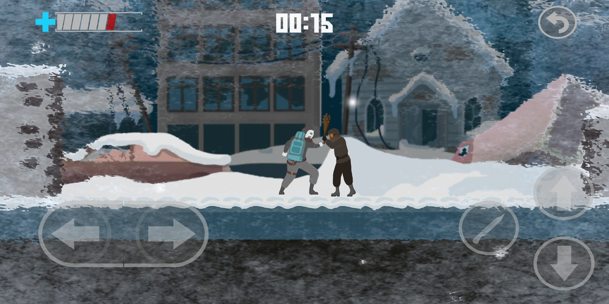
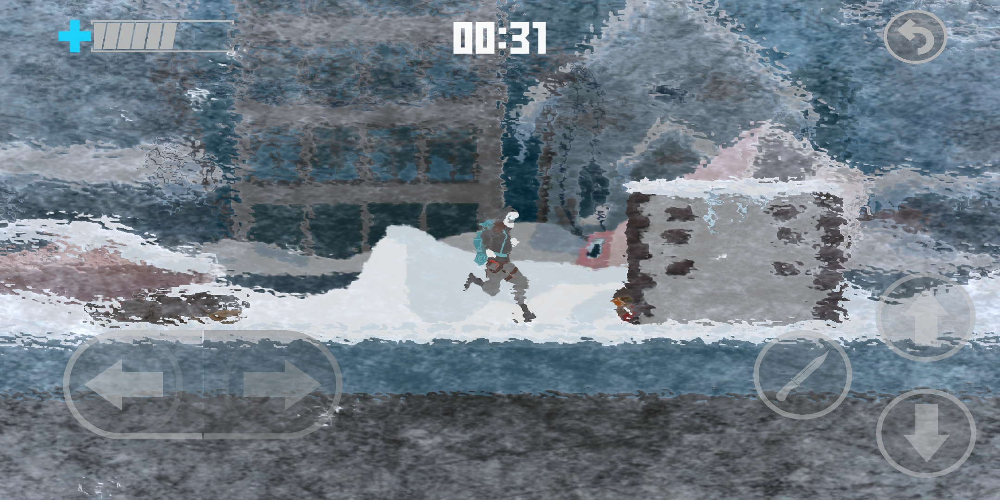

# Icepocalypse
Mobile adventure game created in Unity. ZTGK (2018) 
</br>
<p align="center">
  
  
  
  
</p>

## Getting Started
These instructions will get you a copy of the project up and running on your local machine for development and testing purposes. 

### Cloning
```
$ git clone https://github.com/msuliborski/icepocalypse
```

### Building
Using Unity Game Engine import project and hit play button. It should do everything automatically and let you run the game.

## Built with
* [Unity](https://unity.com/) - The world’s leading real-time creation platform

## Authors
* **Michał Suliborski** - [msuliborski](https://github.com/msuliborski)
* **Konrad Stępniak** - [th7nder](https://github.com/th7nder)
* **Michał Kuśmidrowicz** - [ninjarlz](https://github.com/ninjarlz)
* **Łukasz Gołygowski** - [GroveW](https://github.com/GroveW)
* **Olga Kardas** - [OlgaKar](https://github.com/OlgaKar)
* **Wiktoria Romanowska**

## License
This project is licensed under the MIT License - see the [LICENSE.md](LICENSE.md) file for details
